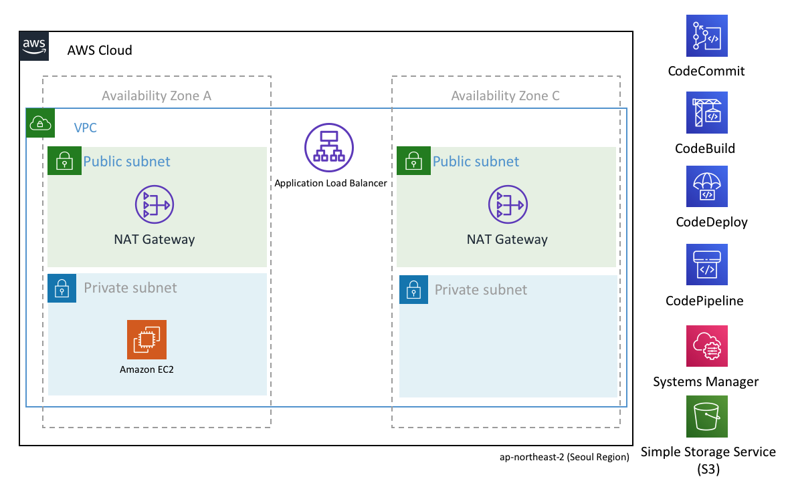

# AWS Infra as code CI/CD (with Terraform)

## 가정 사항

- Infrastructure as code에 대한 기본적인 지식을 가지고 있음
- AWS에 대한 기초적인 지식을 가지고 있음
- 리전 : Seoul (ap-northeast-2)
- 환경 : macOS Catalina Version 10.15.3

## 생성되는 인프라

- 이 예제와 인프라는 비슷함 (https://github.com/toule/aws_cdk_basic_sample)
- VPC (Virtual Private Cloud)
- Subnet
- NAT Gateway
- EC2 (with System Manager)
- ALB (Application Load Balancer)
- Code Series (CodeCommit, CodeBuild, CodeDeploy, CodePipeline)

## CI/CD Pipeline 구성

- 이 예제를 활용 (https://github.com/toule/cicd-sample-demo)

