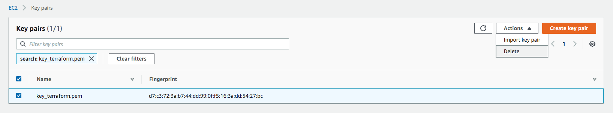

# AWS Infra as code CI/CD (with Terraform)


## 가정 사항

- Infrastructure as code에 대한 기본적인 지식을 가지고 있음

- AWS에 대한 기초적인 지식을 가지고 있음

- 리전 : Seoul (ap-northeast-2)

- 환경 : macOS Catalina Version 10.15.3

  

## 참고 사항

- 환경 : macOS Catalina Version 10.15.3
- 현재 코드의 project명은 sample이며 얼마든지 변경하여 사용가능함
- 비용이 발생할 수 있음
- 결과는 브라우저에 nginx 화면을 보여줌


## 생성되는 인프라

- VPC (Virtual Private Cloud)
- Subnet
- NAT Gateway
- EC2 (with System Manager)
- ALB (Application Load Balancer)
- Code Series (CodeCommit, CodeBuild, CodeDeploy, CodePipeline)


## CI/CD Pipeline 구성

- 이 [예제](https://github.com/toule/cicd-sample-demo)를 활용 (CodePipeline, CodeCommit, CodeBuild, CodeDeploy)

- 참고

  - 일반적으로 소스와 인프라의 CI/CD Pipeline은 분리 시켜야함
  - Terraform의 경우 state 관리를 해줘야하나 현 예제는 생략함


### 추가 사항

- CodeBuild에서 Access key와 Secret key를 파라미터 형태로 기입해야함
- **중요:** 중요한 variable의 경우 System Manager의 Parameter Store 혹은 Secrets Manager를 사용하는 것을 권장함 (현 예제는 용이성은 위해 Plain Text로 사용하였음)


### 실행

- git repository 설정 (생성한 코드 커밋 주소 확인)

```bash
git remote add origin <my-codecommit-repo>
```

- commit (source repoistory가 다른 예제와 섞여서 commit이 되지 않는 경우 -f(force)옵션을 활용해야 함)

```bash
git add .
git commit -m "inital commit"
git push origin master
```


### CodeDeploy Tag 변환

- 기존 예제를 토대로 pipeline을 만들었을 경우 Target에 대한 Key Value 값을 변경해야 함


### 참조

- build log


- deploy status


- pipeline stauts


### 결과 확인

- vpc


- ec2


- nat gateway


- application load balancer


* result (ALB DNS 확인)


### 추가 활용

- 기존에 private subnet에 존재한 EC2에 접근하기 위해서는 점프 서버(Bastion Host)가 필요 했음
- AWS System Manager - Session Manager를 활용하면 바로 접속하여 상태를 확인할 수 있음
- Terraform으로 인프라를 설치할때 SSM(System Manager) Agent와 접속할 때 필요한 Role에 대해서 넣어 두었음
- system manager console


- start session


- terminal


## 인프라 삭제

- Application Load Balancer 삭제
- Target Group 삭제
- Key Pair 삭제



- EC2 Terminate


- Iam Role 삭제
  - terraform-ec2-role
  - codedeploy_role
  - codebuild-gsn-rayhli-build-service-role (AWS가 만들어준 Role이며 이름은 이와 비슷함)
  - AWSCodePipelineServiceRole-ap-northeast-2-gsn-rayhli-pipeline (AWS가 만들어준 Role이며 이름은 이와 비슷함)
  - terraform_ec2_profile (aws configure로 로그인이 되어 있어야함, ec2-role과 이름이 달라 콘솔에서 보이지 않음)

```bash
aws iam delete-instance-profile --instance-profile-name terraform_ec2_profile
```


- NAT Gateway 삭제
  - sample-NAT-A
  - sample-NAT-C
- Endpoints 삭제
  - ec2messages
  - s3
  - ssm


- EIP Relase


- VPC 삭제


- codepipeline 버킷 삭제 (파이프라인을 새로 생성했을 때 만들어지는 버킷)